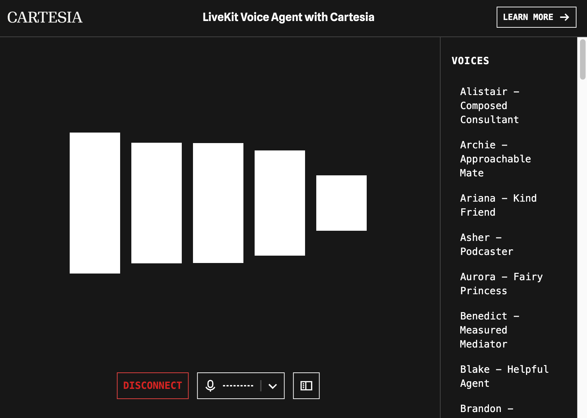

# Cartesia Voice Agent Example

This is a demo of a LiveKit [Voice Agent](https://docs.livekit.io/agents/) using [Cartesia](https://www.cartesia.ai/).

The example includes a custom Next.js frontend and Python agent.

## Live Demo

<https://cartesia-assistant.vercel.app/>



## Running the example

### Prerequisites

- Node.js
- Python >=3.10, <4
- LiveKit API key
- Cartesia API key

### Frontend

Copy `.env.example` to `.env.local` and set the environment variables. Then run:

```bash
cd frontend
npm install
npm run dev
```

### Agent

Copy `.env.example` to `.env` and set the environment variables. Then run:

```bash
cd agent
python -m venv venv
source venv/bin/activate
pip install -r requirements.txt
python main.py dev
```
